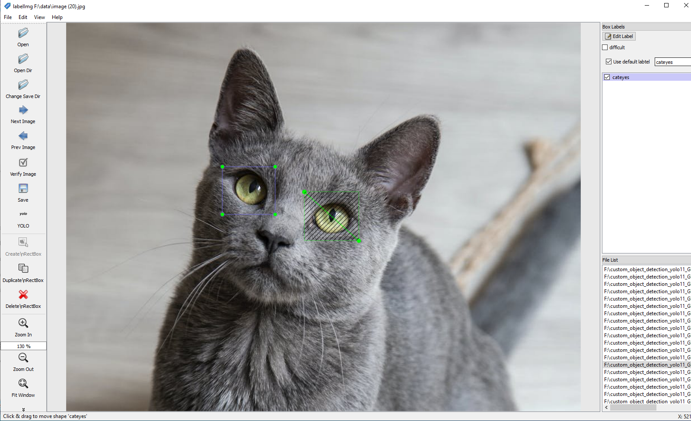
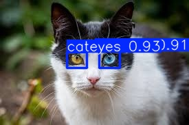
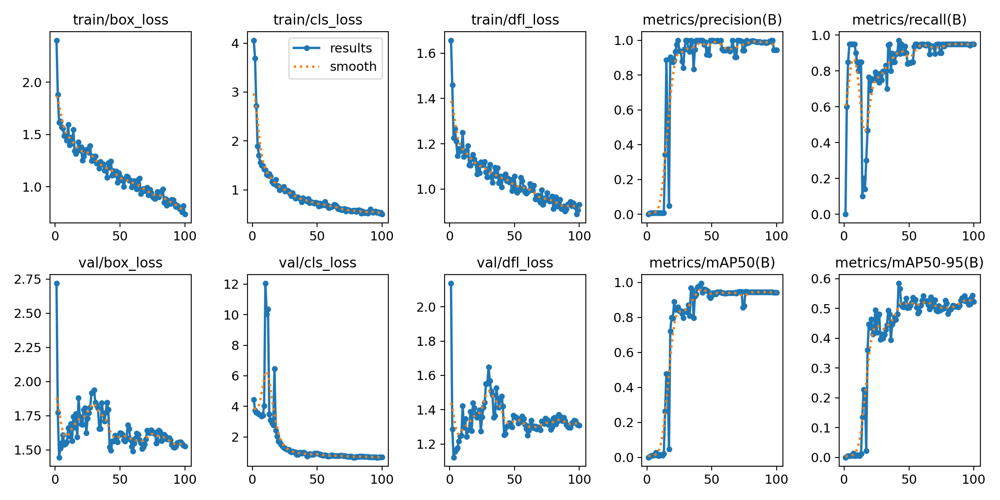
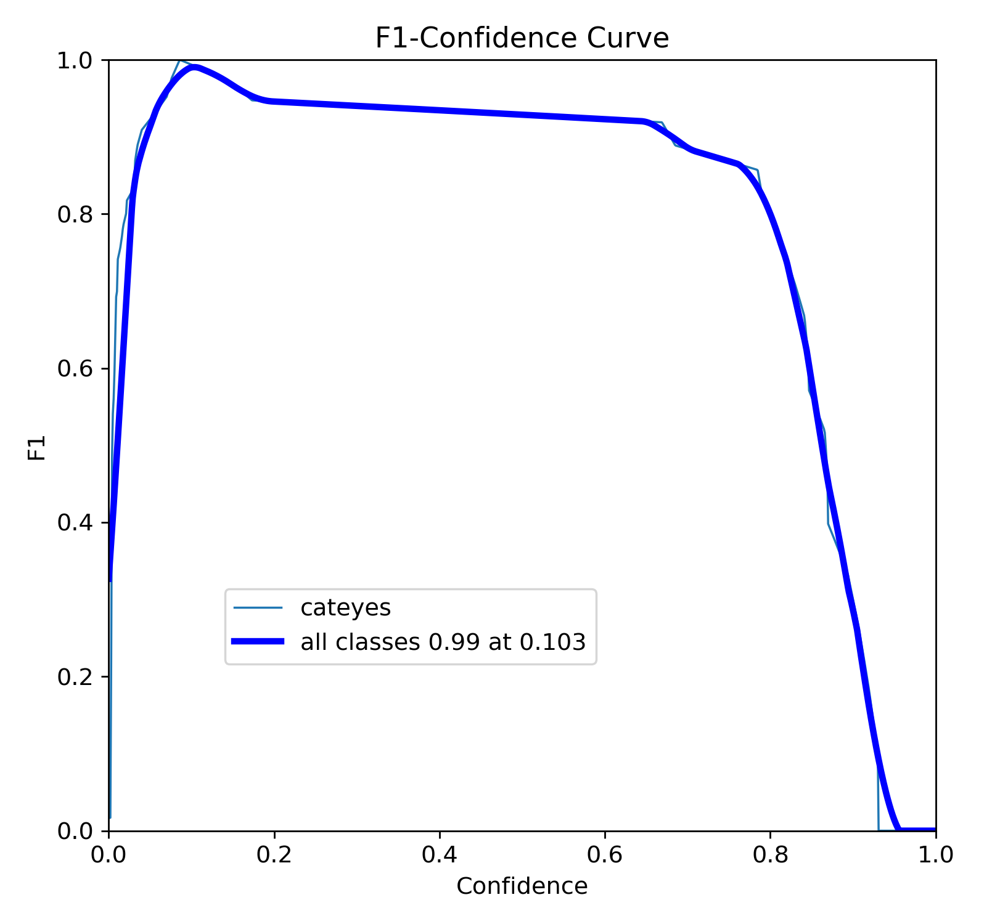
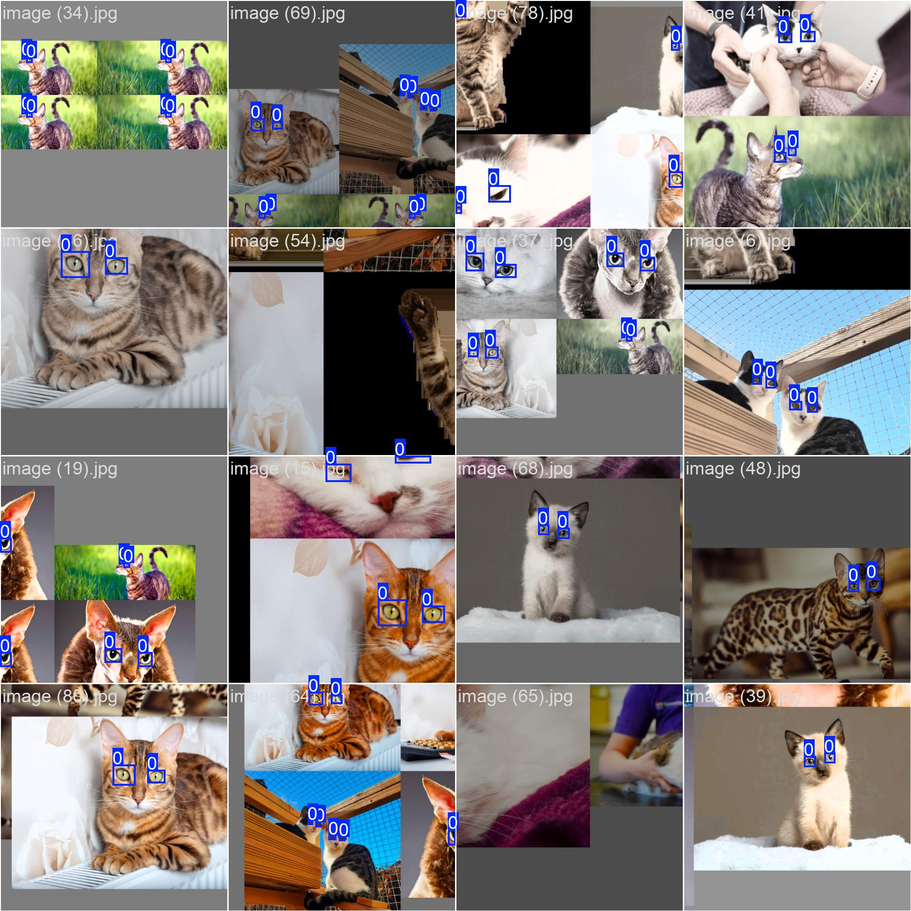

# Custom Object Detection using YOLOv11

This tutorial guides you through the process of creating a custom object detector for cat eyes using YOLOv11 Nano from [Ultralytics](https://www.ultralytics.com/). We’ll cover the entire pipeline — from collecting and labeling data to fine-tuning a pre-trained YOLOv11 Nano model for cat eye detection.


****
## Environment Setup

First, create a conda environment with Python 3.9:

```bash
conda create -n yolov11 python=3.9
conda activate yolov11
```
## Install the necessary packages using pip:
```
pip3 install torch torchvision torchaudio --index-url https://download.pytorch.org/whl/cu118
pip install ultralytics
pip install opencv-python
```


---

## 🐱 Dataset Preparation

1. **Collect Images**  
   I sourced cat images from the internet.

2. **Label the Images**  
   I used [LabelImg](https://github.com/HumanSignal/labelImg/releases) for annotating the images.




---

## 📂 Dataset Structure

In this repo, I have also provided my dataset for reference and conveniance. See `./dataset`. The dataset folder is organized as follows:

```
dataset/
├── train/
│   ├── images/
│   └── labels/
├── valid/
│   ├── images/
│   └── labels/
└── test/
    ├── images/
    └── labels/
```
- **images/** — Contains .jpg image files.
- **labels/** — Contains .txt files with YOLO-style bounding boxes.


---

## 🏷️ Label Format

Each `.txt` label file corresponds to an image and contains bounding box coordinates in **YOLO format**.

**Example:** `image (22).jpg.txt`

```txt
## class_id x_center y_center width height
0 0.532 0.654 0.120 0.098
1 0.412 0.389 0.095 0.077
```
- All values are normalized between `0` and `1`.
- `class_id` represents the object class (e.g., `0` for cat eyes).

---


## 📄 data.yaml

The `data.yaml` file defines dataset paths and class names:

```yaml
train: ./dataset/train/images
val: ./dataset/valid/images
test: ./dataset/test/images

nc: 1  # number of classes
names: ['cateyes']
```

---
## 🚀 Training YOLOv11 Nano

Modify and use the following script (`train.py`) to train the model:

```python
from ultralytics import YOLO

# Load a model
if __name__ == '__main__':
    model = YOLO("yolo11n.pt")  # Using YOLOv11 Nano model 
    data_path = r"F:/path/to/dataset/data.yaml"  # Path to data.yaml

    # Train the model
    train_results = model.train(
        data=data_path,   # Dataset YAML
        epochs=100,       # Number of epochs
        imgsz=640,        # Image size
        device=0          # GPU device (0) or 'cpu'
    )
```

- you will find the trained model in the `./runs` folder. 
- Check [ultralytics configurations](https://docs.ultralytics.com/usage/cfg/#modes) to familiarize yourself with the model class and parameters and customize the training process as needed.


### Here are some results from our training:

<table>
  <tr>
    <td></td>
    <td></td>
  </tr>
  <tr>
    <td></td>
    <td></td>
  </tr>
</table>


**Note** that here we are using the YOLOv11 Nano model, which is a smaller version of the YOLO model. Other models include:

| Model    | Size (pixels) | mAP<sub>val</sub> 50-95 | Speed CPU ONNX (ms) | Speed T4 TensorRT10 (ms) | Params (M) | FLOPs (B) |
|----------|---------------|-------------------------|---------------------|--------------------------|------------|----------|
| YOLO11n  | 640           | 39.5                    | 56.1 ± 0.8          | 1.5 ± 0.0                | 2.6        | 6.5      |
| YOLO11s  | 640           | 47.0                    | 90.0 ± 1.2          | 2.5 ± 0.0                | 9.4        | 21.5     |
| YOLO11m  | 640           | 51.5                    | 183.2 ± 2.0         | 4.7 ± 0.1                | 20.1       | 68.0     |
| YOLO11l  | 640           | 53.4                    | 238.6 ± 1.4         | 6.2 ± 0.1                | 25.3       | 86.9     |
| YOLO11x  | 640           | 54.7                    | 462.8 ± 6.7         | 11.3 ± 0.2               | 56.9       | 194.9    |

See the [Detection Docs](https://www.ultralytics.com/) for usage examples with these models trained on **COCO**, which include 80 pre-trained classes.


---

## 🔍 Testing the Model

After training, run (`test.py`) inference on a test image:

```python
from ultralytics import YOLO
import torch

# Check GPU availability
print("GPU available: ", torch.cuda.is_available())

# Load trained model checkpoint
checkpoint = "./runs/detect/train/weights/best.pt"
input_image = "./dataset/test/images/image (95).jpg"
model = YOLO(checkpoint)

# Run detection
results = model(source=input_image, conf=0.3, show=True, save=True)

# Print results
print('Results: ', results)
print('Boxes: ', results[0].boxes)
print('Done!')
```
- `conf=0.3` sets the confidence threshold.
- `show=True` displays the image with detections.
- `save=True` saves the output to disk (default: `./runs/detect/predict`).


## Export the Model to ONNX Format if needed
To export your trained model to ONNX format, use the following line in your code:
```commandline
path = model.export(format="onnx")  # return path to exported model
```
